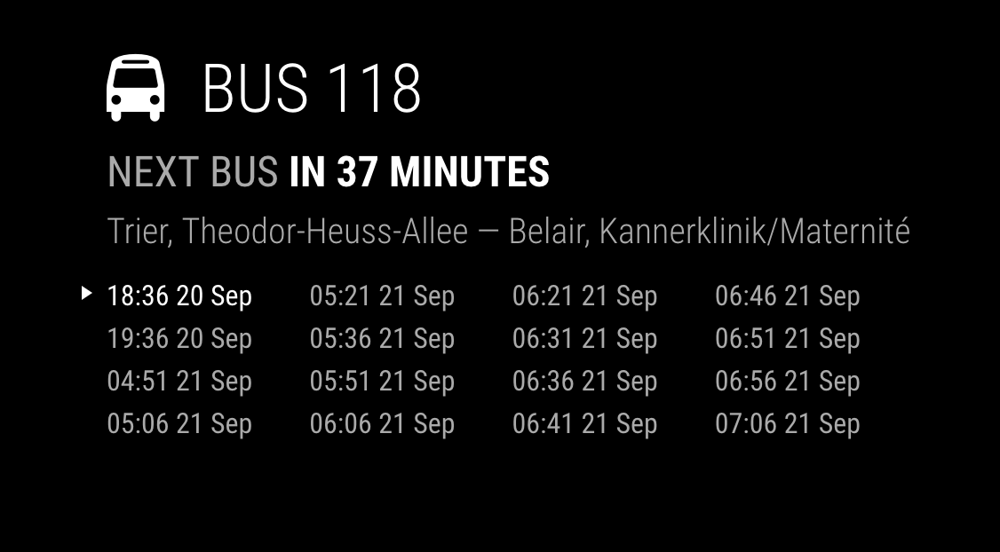

# MMM-Luxembourg-Public-Transport

Luxembourg public transport departures in real time. Module for [MagicMirror²](https://github.com/MagicMirrorOrg/MagicMirror).

## Screenshot



## Installation

In your terminal, go to your MagicMirror's Module folder:

```shell
cd ~/MagicMirror/modules
```

Clone this repository:

```shell
git clone https://github.com/uxigene/MMM-Luxembourg-Public-Transport
```

## Update

Go to the module’s folder inside your MagicMirror's module folder and pull the latest version:

```bash
cd ~/MagicMirror/modules/MMM-Luxembourg-Public-Transport
git pull
```

## Configuration

To use this module, add it to the modules array in the `config/config.js` file:

```javascript
    {
        module: "MMM-Luxembourg-Public-Transport",
        config: {
            stationId: 0,
            apiKey: "<api key>"
        }
    },
```

### Configuration options

Please check this [API](https://data.public.lu/en/datasets/arrets-de-transport-public-et-departs-en-temps-reel/).

The following property can be configured:

| Option         | Required | Description                                                                                                                                                                             | Default value |
|----------------|----------|-----------------------------------------------------------------------------------------------------------------------------------------------------------------------------------------|:-------------:|
| stationId      | YES      | Station ID. Can be found using the Mobiliteit.lu API. Documented on [data.public.lu](https://data.public.lu/fr/datasets/api-mobiliteit-lu/). The key ```extId``` includes the stationId |       -       |
| apiKey         | YES      | Mobiliteit.lu API Key, can be requested on [data.public.lu](https://data.public.lu/fr/datasets/api-mobiliteit-lu/)                                                                      |       -       |
| duration       | NO       | Interval size in minutes. Range is from 1 to 1439 minutes. [API parameter](http://travelplanner.mobiliteit.lu/restproxy/departureBoard?wadl).                                           |      720      |
| fetchInterval  | NO       | Fetch interval in milliseconds.                                                                                                                                                         |     6000      |
| maxResults     | NO       | Maximum items to be displayed in schedule.                                                                                                                                              |      16       |
| animationSpeed | NO       | [Animation speed in milliseconds.](https://github.com/MagicMirrorOrg/MagicMirror/blob/master/modules/README.md#thisupdatedomspeed)                                                            |     2000      |
